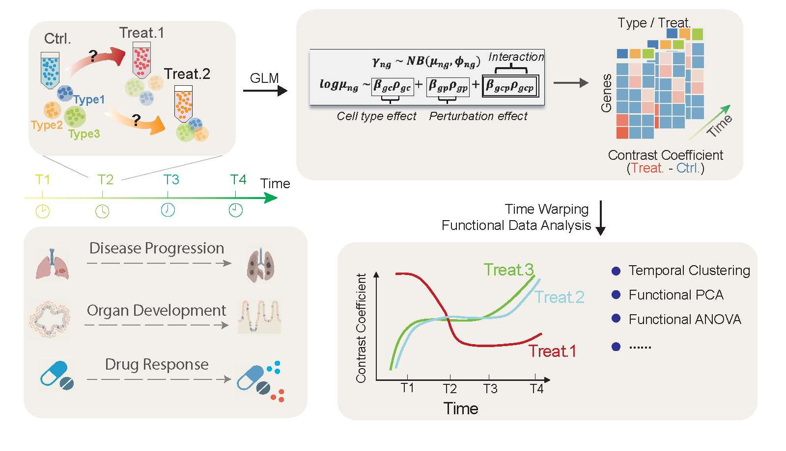

[](https://celldrift.readthedocs.io/en/latest/index.html) [](https://pypi.org/project/CellDrift/)  [](https://github.com/KANG-BIOINFO/CellDrift/stargazers)

# CellDrift
CellDrift: temporal perturbation effects for single cell data

Perturbation effects on gene programs are commonly investigated in single-cell experiments. Existing models measure perturbation responses independently across time series, disregarding the temporal consistency of specific gene programs. We introduce CellDrift, a generalized linear model based functional data analysis approach to investigate temporal gene patterns in response to perturbations. 


### Reference
```
CellDrift: Inferring Perturbation Responses in Temporally-Sampled Single Cell Data. BioRxiv. Apr 2022 (https://www.biorxiv.org/content/10.1101/2022.04.13.488194v1)
```

### Prerequisite
```python
# It's recommended to create a new environment using conda (python 3.7 is recommended)
conda create -n celldrift_py python=3.7
# Install prerequisite package scikit-fda (development version)
conda activate celldrift_py # activate celldrift environment
pip install git+https://github.com/GAA-UAM/scikit-fda.git
```

### Installation
```python
pip install CellDrift
```

### Tutorial
- [Example on HIV Infection Study](https://github.com/KANG-BIOINFO/CellDrift/blob/main/Tutorial/hiv_infection_tutorial.md)
- [Example on Pseudo-time Data of Brain Organoid Development](https://github.com/KANG-BIOINFO/CellDrift/blob/main/Tutorial/brain_pseudotime_tutorial.md)
- [Check the complete Document](https://celldrift.readthedocs.io/en/latest/index.html)

### Quick Start
```python
import numpy as np
import pandas as pd
import scanpy as sc
import CellDrift as ct
```

#### 1. Load data and preparation
```python
adata = sc.read("example.h5ad")
adata.obs['size_factor'] = np.sum(adata.X, axis = 1)
```

#### 2. Set up CellDrift object
```python
adata = ct.setup_celldrift(
    adata, 
    cell_type_key = 'cell_type',
    perturb_key = 'perturb', 
    time_key = 'time', # the name of time covariate. Must be numeric
    control_name = 'Control', 
    perturb_name = None, 
    size_factor_key = 'size_factor', 
    batch_key = 'batch', 
    n_reps = 3,
    n_cells_perBlock = 100,
    use_pseudotime = False,
    min_cells_perGene = 0
)
```

#### 3. Run GLM model 
```python
adata = ct.model_timescale(
    adata, 
    n_processes = 16, # number of processes for multiprocessing
    chunksize = 100, # number of genes in each chunk
    pairwise_contrast_only = True, 
    adjust_batch = False
)
```

#### 4. set up FDA object
```python
df_zscore = pd.read_csv('Temporal_CellDrift/Contrast_Coefficients_combined_zscores_.txt', sep = '\t', header = 0, index_col = 0) # CellDrift z scores
df_meta = pd.read_csv('Temporal_CellDrift/Contrast_Coefficients_combined_metadata_.txt', sep = '\t', header = 0, index_col = 0) # metadata of contrast comparisons

fda = ct.FDA(df_zscore, df_meta)
```

#### 5. temporal clustering
```python
fd, genes = fda.create_fd_genes(genes = df_zscore.index.values, cell_type = 'Type_0', perturbation = 'Perturb_0')
df_cluster = ct.fda_cluster(fd, genes, n_clusters = 3)
```

#### 6. visualization for each temporal cluster
```python
ct.draw_smoothing_clusters(
    fd, 
    df_cluster, 
    n_neighbors = 2, 
    bandwidth = 1,
    cluster_key = 'clusters_fuzzy', 
    output_folder = 'Temporal_CellDrift/cluster_fuzzy/'
)
```