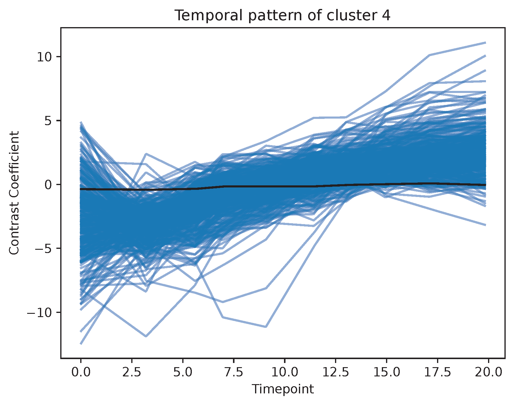

# Example of pseudotime analysis in brain organoids using CellDrift

This is a large-scale single cell RNA-seq data for the investigation of haploinsufficiency of three autism risk genes in brain organoids, including SUV420H1, ARID1B and CHD8. It covers 745,000 brain organoid cells from early time points (such as 28 days) and late time points (such as 6 months). Data can be accessed from single cell portal SCP1129.

0. Load data and preparation
```python
import numpy as np
import pandas as pd
import scanpy as sc
import CellDrift as ct

adata = sc.read('../data/SUV420H1_Mito210_d35_reintegrated_raw_v2.h5ad')
adata.obs['size_factor'] = np.sum(adata.X.toarray(), axis = 1)
adata.obs['lineage'] = 'CN_lineage' # we care less about cell types in this case
kc = 'lineage'
kp = 'treat'
kt = 'pseudotime'
```

1. Feature Selection
The reason for feature selection is to investigate the most interesting genes and to reduce running time.
```python
# select highly variable genes
def select_variable_genes(data, n_top_genes):
    # normalize raw data
    sc.pp.filter_genes(data, min_cells = 200)
    sc.pp.normalize_total(data, target_sum=1e4)
    sc.pp.log1p(data)
    # select top variable genes
    sc.pp.highly_variable_genes(data, n_top_genes = n_top_genes) 
    high_var_genes = data.var_names[data.var.highly_variable]

    return high_var_genes

high_var_genes = select_variable_genes(adata.copy(), n_top_genes = 2000)
adata = adata[:, high_var_genes].copy()
```

2. Set up CellDrift object
```python
adata = ct.setup_celldrift(
    adata, 
    cell_type_key = kc, 
    perturb_key = kp, 
    time_key = kt, # the name of time covariate. Must be numeric
    control_name = 'wt', 
    perturb_name = None, 
    size_factor_key = 'size_factor', 
    batch_key = None,
    min_cells_perGene = 200,
    use_pseudotime = True
)
```

3. Run GLM model 
```python
adata = ct.model_timescale(
    adata, 
    n_processes = 8, # number of processes for multiprocessing
    chunksize = 100, # number of genes in each chunk
    pairwise_contrast_only = True,
    adjust_batch = False
)
```

4. set up FDA object
```python
# load data
df_zscore = pd.read_csv('Temporal_CellDrift/Contrast_Coefficients_combined_zscores_.txt', sep = '\t', header = 0, index_col = 0)
df_meta = pd.read_csv('Temporal_CellDrift/Contrast_Coefficients_combined_metadata_.txt', sep = '\t', header = 0, index_col = 0)

# create object
cell_type = 'CN_lineage'
perturbations = ['mut']
perturbation = 'mut'
fda = ct.FDA(df_zscore, df_meta)
```

5. temporal clustering
```python
# find clusters
input_genes = df_zscore.index.values
fd1, genes = fda.create_fd_genes(input_genes, cell_type = cell_type, perturbation = perturbation)
df_cluster = ct.fda_cluster(fd1, genes, n_clusters = 8, seed = 42, output_folder = 'Temporal_CellDrift/')

# visualize clusters
ct.draw_smoothing_clusters(fd1, df_cluster, n_neighbors = 2, bandwidth = 1, 
                        cluster_key = 'clusters_fuzzy', output_folder = 'Temporal_CellDrift/cluster_fuzzy/')

ct.draw_smoothing_clusters(fd1, df_cluster, n_neighbors = 2, bandwidth = 1, 
                        cluster_key = 'clusters_kmeans', output_folder = 'Temporal_CellDrift/cluster_kmeans/')
```

- "Increasing" Pattern (Temporal cluster 4)

- "Decreasing" Pattern (Temporal cluster 2)
