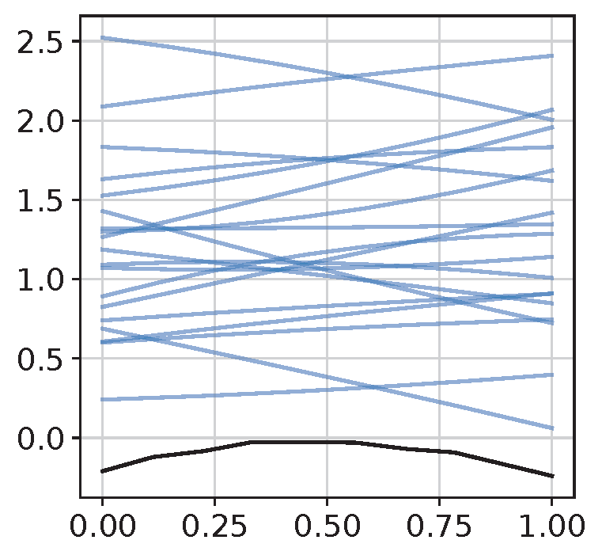
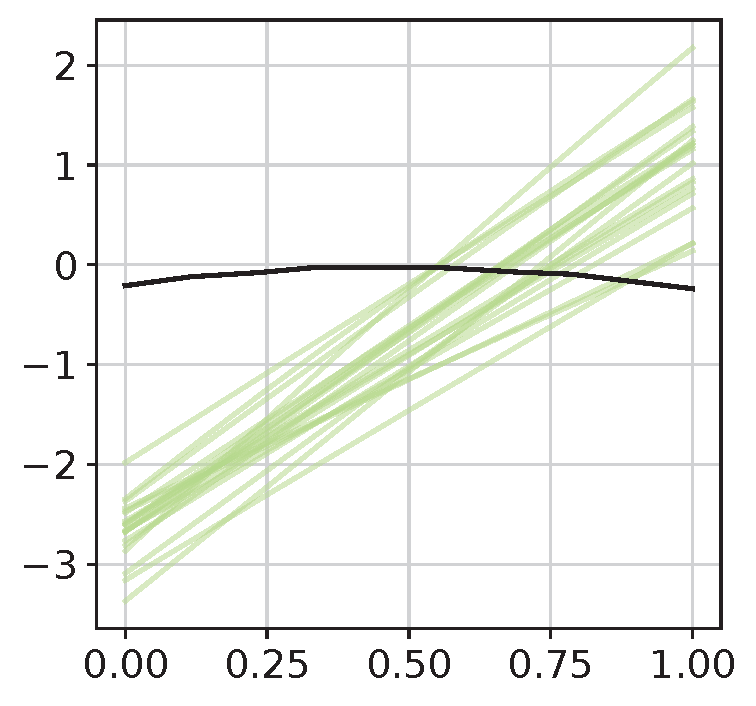

# Example of Fetal Gut Differentiation
This 


1. Load data and preparation
```python
import numpy as np
import scanpy as sc
import CellDrift as ct

adata = sc.read('simulation_n_times_10_rep0.h5ad')
adata.obs['size_factor'] = np.sum(adata.X, axis = 1) # compuate size factor
adata.obs['batch'] = 0 # assume there's only one batch
adata

>>> AnnData object with n_obs × n_vars = 6000 × 60
        obs: 'cell_type', 'perturb', 'time', 'batch'
        uns: 'M', 'N', 'beta_metadata', 'n_perts', 'n_types', 'theta'
        varm: 'beta'
```


2. Set up CellDrift object
```python
adata = ct.setup_celldrift(
    adata, 
    cell_type_key = 'cell_type',
    perturb_key = 'perturb', 
    time_key = 'time', # the name of time covariate. Must be numeric
    control_name = 'Control', 
    perturb_name = None, 
    size_factor_key = 'size_factor', 
    batch_key = 'batch'
)
```


3. Run GLM model 
```python
adata = ct.model_timescale(
    adata, 
    n_processes = 16, # number of processes for multiprocessing
    chunksize = 60, # number of genes in each chunk
    pairwise_contrast_only = True, 
    adjust_batch = False
)
os.listdir('output_celldrift')

>>> ['time_1.0.h5ad', 'glm_predictions_time_0.33.txt', 'time_0.67.h5ad', 'glm_predictions_pairwise_comparisons_time_0.11.txt', 'glm_predictions_time_0.89.txt', 'glm_predictions_pairwise_comparisons_time_0.22.txt', 'time_0.33.h5ad', 'time_0.0.h5ad', 'glm_predictions_pairwise_comparisons_time_0.56.txt', 'glm_predictions_pairwise_comparisons_time_0.0.txt', 'glm_predictions_pairwise_comparisons_time_0.33.txt', 'glm_predictions_pairwise_comparisons_time_1.0.txt', 'glm_predictions_time_0.22.txt', 'time_0.11.h5ad', 'glm_predictions_time_0.44.txt', 'time_0.22.h5ad', 'time_0.89.h5ad', 'glm_predictions_pairwise_comparisons_time_0.44.txt', 'glm_predictions_time_1.0.txt', 'glm_predictions_time_0.11.txt', 'time_0.56.h5ad', 'glm_predictions_time_0.67.txt', 'glm_predictions_time_0.56.txt', 'glm_predictions_time_0.0.txt', 'time_0.44.h5ad', 'time_0.78.h5ad', 'glm_predictions_pairwise_comparisons_time_0.89.txt', 'glm_predictions_pairwise_comparisons_time_0.67.txt', 'glm_predictions_time_0.78.txt', 'glm_predictions_pairwise_comparisons_time_0.78.txt']
```

4. Organize the output for functional data analysis (FDA)
```python
ct.organize_output(output_folder = 'output_celldrift/')
os.listdir('fda_celldrift')

>>> ['pairwise_contrasts_metadata_.txt', 'pairwise_zscores_combined_.txt']
```


5. set up FDA object
```python
df_zscore = pd.read_csv('fda_celldrift/pairwise_zscores_combined_.txt', sep = '\t', header = 0, index_col = 0)
df_meta = pd.read_csv('fda_celldrift/pairwise_contrasts_metadata_.txt', sep = '\t', header = 0, index_col = 0)

fda = ct.FDA(df_zscore, df_meta)
```

6. temporal clustering
```python
fd, genes = fda.create_fd_genes(genes = df_zscore.index.values, cell_type = 'Type_0', perturbation = 'Perturb_0')
df_cluster = ct.fda_cluster(fd, genes, n_clusters = 3)
df_cluster.head()

>>>
     genes  clusters_kmeans  clusters_fuzzy
0   Gene_0                0               0
1   Gene_1                0               0
2  Gene_10                0               0
3  Gene_11                0               0
4  Gene_12                0               0
```

7. visualization for each temporal cluster
```python
genes = df_zscore.index.values
ct.draw_smoothing_clusters(
    fd, 
    df_cluster, 
    genes = genes, 
    n_neighbors = 2, 
    bandwidth = 1, 
    cluster_key = 'clusters_fuzzy', 
    output_folder = 'fda_celldrift/figures/'
)
```
Visualization of several clusters (smoothing using LR method)
- Pattern1

- Pattern2

- Pattern3

