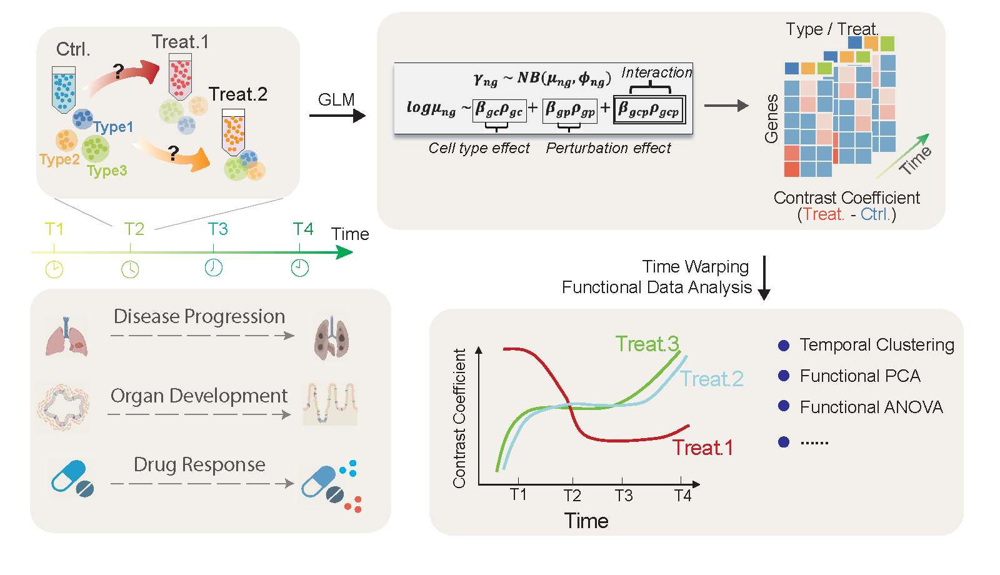
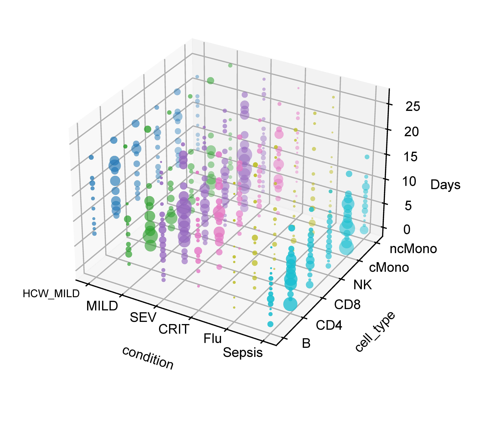
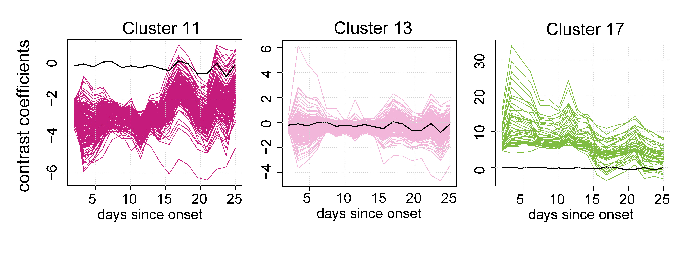

Introduction
==================

.. _narrative_background:

Why do we develop CellDrift?
------------------------------
Researchers have applied the single-cell RNA-sequencing technology in experiments with perturbation settings such as diseases, treatments, genetic mutations, and organ differentiation to explore transcriptional profiles across various biochemical states. 

The response to perturbation can vary over time, which is overlooked in many single cell studies. As a result, we develop CellDrift, a generalized linear model-based functional data analysis method capable of identifying covarying temporal patterns of various cell types in response to perturbations. It includes functions below:

1. Disentangle common and cell type specific perturbation effects across time;
2. Identify patterns of genes that have similar temporal perturbation responses;
3. Prioritize genes with distinct temporal perturbation responses between perturbations or cell types;
4. Infer differential genes of perturbational states in the pseudo-time trajectories.

What is the appropriate input data?
-------------------------------------
Since CellDrift was designed to resolve the temporal perturbation effects in single cell data, users need to input single cell data with at least the time and perturbation covariates. It is encouraged to provide cell type annotations, so users can take the advantage of CellDrift to interrogate the cell-type-specific perturbation effects along the time.
For example, the image below is an overview of COVID-19 single cell metadata, which contains cell type, perturbation and time covariates.

The input data should be anndata, and cell type, perturbation, time, batch covariates should be included in the .obs in the anndata, for example:

What is the expected output?
------------------------------
There are two parts of the output of CellDrift, including the output of the generalized linear model (under folder "Coefficients_CellDrift"), and the output of functional data (temporal) analysis (under folder "Temporal_CellDrift").
1. The generalized linear model output is stored in txt files, which contains cell-type specific coefficients and their z scores for each time points.
2. The temporal analysis output is represented as clustering assignments, or smoothing curves for each temporal patterns.

